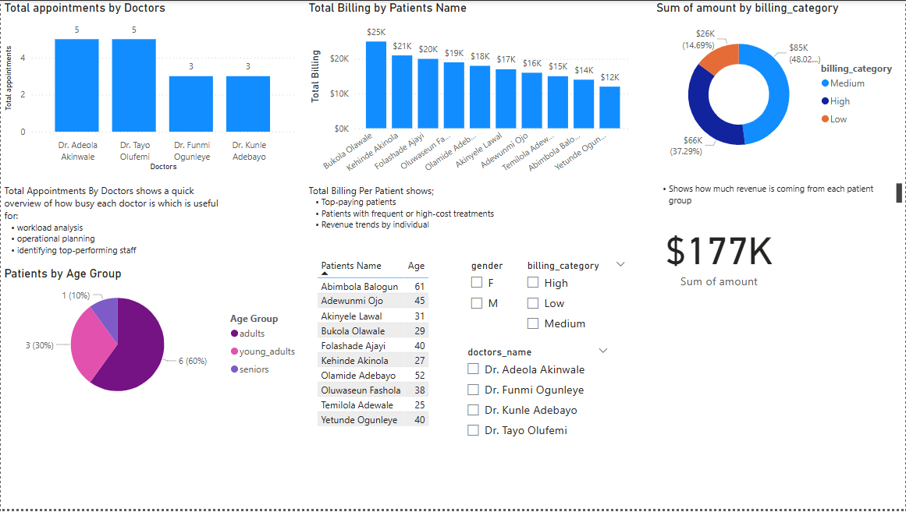

# Hospital Management Analytics with SQL & Power BI

This project demonstrates a simple but powerful healthcare analytics dashboard I created **from scratch** using SQL Server and Power BI. It simulates a hospital environment with patients, doctors, appointments, lab tests, and billing data.

---

## 📌 Project Overview

- **Domain**: HospitalManagement
- **Tools Used**: SQL Server, Power BI
- **Skills Demonstrated**: SQL querying, data modeling, DAX logic, Power BI visualization
- **Goal**: To uncover insights into hospital operations like doctor workload, billing trends, and patient demographics.

---

## 🧱 Project Structure

### 1. SQL Phase

I manually created tables, inserted mock data, and wrote queries to perform:

#### 📗 Section 1: Basic SQL Queries
- SELECT, WHERE, ORDER BY, ALIAS

#### 📘 Section 2: Intermediate SQL
- Filtering with multiple conditions
- Aggregations with `GROUP BY`, `HAVING`
- Joins (`INNER`, `LEFT`, `RIGHT`, `FULL`, `CROSS`)
- Subqueries (nested logic)
- `CASE` statements for categorization

#### 📙 Section 3: Advanced SQL
- Views
- Stored Procedures
- Triggers (AFTER INSERT/UPDATE for automation)

---

## 📊 Power BI Phase

I connected Power BI to SQL Server and built a full visual dashboard using cleaned, transformed data.

### 📌 Key Insights Visualized

| Chart | Description |
|-------|-------------|
| **Total Appointments by Doctors** | Measures each doctor's workload. Helpful for staffing and performance monitoring. |
| **Total Billing by Patients** | Shows which patients contribute the most to revenue. |
| **Billing Category (Donut Chart)** | Breaks revenue down by cost tiers: Low, Medium, High. |
| **Patients by Age Group (Pie Chart)** | Distribution of patients across age categories (`young_adults`, `adults`, `seniors`). |
| **Total Revenue Card** | Displays total billing amount from all patients. |
| **Interactive Filters** | By doctor name, billing category, and gender for dynamic reporting. |

🖼️ Example Dashboard:



---

## 📂 Folder Structure

```
Hospital-Management-SQL-PowerBI/
│
├── SQL_Code/
│   ├── create_tables.sql
│   ├── insert_data.sql
│   ├── queries.sql
│   └── trigger_procedure_view.sql
│
├── PowerBI_Dashboard/
│   ├── powerbi_model.pbix
│   └── screenshots/
│       ├── 1_tables.png
│       ├── 2_insert.png
│       ├── 3_basic_select.png
│       ├── 4_join_query.png
│       ├── 5_groupby_having.png
│       ├── 6_case_or_subquery.png
│       ├── 8_powerbi_model_view.png
│       ├── 9_cleaned_table.png
│       ├── 10_barchart_doctor_appt.png
│       ├── 11_billing_category_chart.png
│       └── 12_dashboard_overview.png
│
└── README.md
```

---

## 🚀 Future Ideas

- Add Excel export option for reports
- Add patient visit frequency analytics
- Automate billing trigger email alerts
- Integrate Python or R for predictive models (e.g., predicting high-cost patients)

---

## 💼 Made For

I built this project to demonstrate my end-to-end capability in **SQL + Power BI** for real-world data analysis in healthcare.

> 🔗 Connect with me on [LinkedIn](www.linkedin.com/in/richard-jetevu-31a648331/) or view this live in my [Medium blog](https://medium.com/@fezzythrillz/how-i-built-a-hospital-management-dashboard-using-sql-and-power-bi-from-scratch-2f5b2df0d5c1) and GitHub.

---
